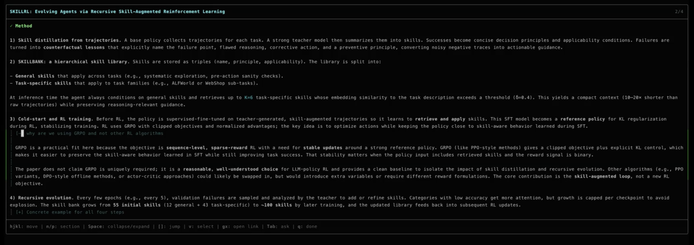
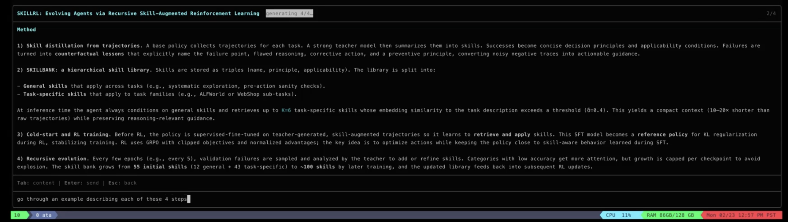
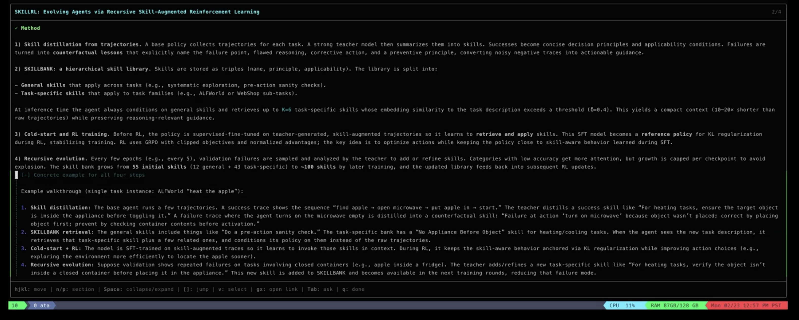

# Why we stopped putting long AI output in chat

Ask any AI to explain a research paper. The explanation is usually good. The problem is the interface it's sitting in.

You read through it in the chat window. You have a question about the attention mechanism. You ask. The answer shows up at the bottom of the conversation, completely disconnected from the section it's about. You ask two more questions. Now the useful content is in four different places in a chat log and you're scrolling up and down trying to piece together a coherent understanding.

The more questions you ask, the more scattered things get. That's exactly backwards — follow-ups should make things clearer, not harder to find.

We ran into this building an AI research agent. The agent reads papers, does synthesis, comparative analysis — stuff that produces long, structured output. We tried chat first because that's what everyone does. It didn't work. Not because the content was bad, but because chat is a conversation interface and the output was a document.

## The thing that actually mattered

We built a reading view — navigable sections, foldable detail blocks. That part was obvious. The design decision that actually changed things: follow-up questions modify the document in place instead of creating new messages.

You're reading section 3, something's confusing, you ask a question. The agent doesn't append a new message. It updates section 3 with the answer woven in. The section heading highlights so you see what changed.

This means every question makes the document better instead of making the chat log longer. Your understanding accumulates in one place.

A few other things we figured out along the way:

**Outline-first streaming.** Send all the section headings first, then fill them in one by one. You start reading immediately and you know what's coming. Sounds small but it changes how it feels to wait for generation.

**Foldable detail.** Hyperparameters, training schedules, exact dimensions — stuff you want available but not always visible. The agent marks it foldable with a short summary line. Expand when you need it.

**Visual selection for questions.** Instead of typing "the part about the encoder in the third paragraph," you highlight the text and ask about it. The agent gets the exact passage. Turns vague follow-ups into precise ones.

## What's still hard

Deciding when to rewrite vs. append is tricky. Sometimes the right answer to a question is rewriting part of the explanation. Sometimes it's adding a paragraph. We have heuristics for this but they're not perfect — the agent sometimes appends when a rewrite would be better.

And there's a real tension between keeping sections stable (so you can find things) and letting them evolve (so they improve). We don't have this fully figured out yet.

## The broader point

Chat was the first interface for LLMs because it was easy. But a lot of AI output — research synthesis, architecture walkthroughs, comparative analysis — isn't a conversation. It's a document. The interface should match.

We built this into `ata`, an open-source research agent: [github.com/Agents2AgentsAI/ata](https://github.com/Agents2AgentsAI/ata)
