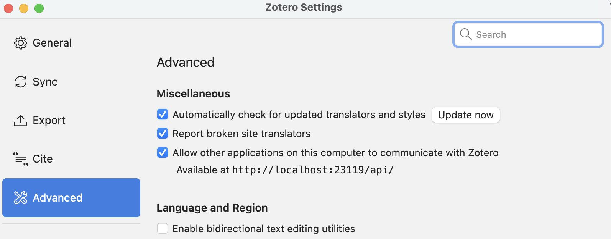

# Setting Up Zotero with Ata

## Why Ata + Zotero?

Ata brings AI-powered research assistance directly into your terminal — and when paired with Zotero, it becomes a powerhouse for academic and professional research. Search your entire reference library, summarize papers, pull citations, and organize findings without ever leaving the command line. No more context-switching between your PDF reader, browser, and reference manager. Just ask Ata, and your Zotero library is at your fingertips.

## Local API Setup

Zotero exposes a local HTTP API that allows other applications on your computer to interact with your Zotero library. This guide walks you through enabling it.

## Prerequisites

- [Zotero](https://www.zotero.org/download/) installed on your machine

## Enable the Local API

1. Open Zotero
2. Go to **Settings** (or **Preferences** on older versions)
3. Select the **Advanced** tab
4. Under **Miscellaneous**, check **"Allow other applications on this computer to communicate with Zotero"**



Once enabled, the Zotero local API is available at:

```
http://localhost:23119/api/
```

## Verifying the Connection

You can confirm the API is running by opening a terminal and running:

```shell
curl http://localhost:23119/api/users/0/items?limit=1
```

A successful response means the local API is active and ready to use.

## Setting Up a Zotero Web API Key

A Web API key lets you (or external tools) access your Zotero library over the internet via the [Zotero Web API](https://www.zotero.org/support/dev/web_api/v3/basics).

### Creating a Key

1. Log in to your Zotero account
2. Go to [https://www.zotero.org/settings/keys/new](https://www.zotero.org/settings/keys/new)
3. Enter a descriptive name for the key (e.g. "Ata CLI")
4. Select the permissions you need:
   - **Allow library access** — required to read your library
   - **Allow notes access** — required to access notes
   - **Allow write access** — required to create, edit, or delete items
5. Optionally configure **group permissions** (None / Read Only / Read/Write)
6. Click **Save Key**
7. Copy the generated key and store it securely


### Finding Your User ID

Your Zotero user ID is required when using the Web API. To find it:

1. Log in to [zotero.org](https://www.zotero.org)
2. Go to [https://www.zotero.org/settings/keys](https://www.zotero.org/settings/keys)
3. Your user ID is displayed at the top of the page (a numeric value)

## Configuring Ata

Ata supports two modes for connecting to Zotero: **local** (default) and **remote** (via Web API).

### Local Mode (Default)

If Zotero is running on your machine with the local API enabled, Ata connects automatically — no configuration needed.

### Remote Mode (Web API)

To access your Zotero library remotely, set the following environment variables:

| Variable | Required | Description |
|---|---|---|
| `ZOTERO_API_KEY` | Yes | Your Web API key (created above) |
| `ZOTERO_USER_ID` | Yes | Your Zotero user ID |
| `ZOTERO_LIBRARY_TYPE` | No | Set to `user` or `group` to restrict to a single library. If omitted, Ata searches your personal library and all group libraries automatically. |
| `ZOTERO_GROUP_ID` | No | Required if `ZOTERO_LIBRARY_TYPE` is `group` |

For example:

```shell
export ZOTERO_API_KEY="your-api-key-here"
export ZOTERO_USER_ID="12345678"
```

When `ZOTERO_API_KEY` is set, Ata automatically switches from the local API to the remote Zotero Web API (`https://api.zotero.org`).

### Config File (Optional)

Non-secret settings like `zotero_user_id`, `zotero_library_type`, and `zotero_group_id` can also be set in your `config.toml` under the `[research]` section:

```toml
[research]
zotero_user_id = "12345678"
zotero_library_type = "user"
```

## Usage with Ata

Once configured, Ata can communicate with your Zotero library to search, retrieve, and work with your references directly from the command line.
